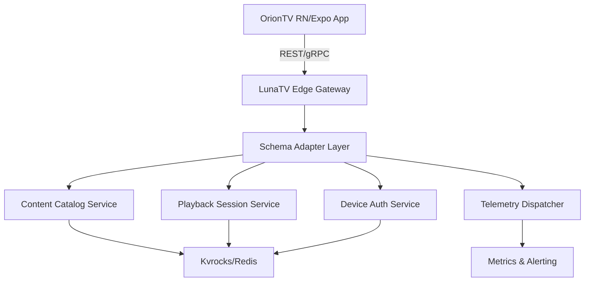

# LunaTV-OrionTV Integration

Feature Name: lunatv-oriontv-integration
Updated: 2026-03-02

## Description

本技术设计定义 LunaTV 后端与 OrionTV 安卓电视客户端之间的适配架构，涵盖 API 协议、数据模型转换、认证流程、播放会话控制、遥测与错误处理，确保电视端体验与 Web 端保持一致且能充分复用 LunaTV 的智能推荐与内容生态。

## Architecture



### 架构说明

- **Edge Gateway**：Next.js API Route 层或 Node.js 中间件，负责多租户路由、请求速率限制、版本检查。
- **Schema Adapter**：集中处理 LunaTV 现有内部数据模型与 OrionTV 所需结构之间的转换与填充。
- **Content/Playback/Auth Services**：复用 LunaTV 既有服务逻辑，暴露 TV 专用端点并使用 Kvrocks/Redis 做状态缓存。
- **Telemetry Dispatcher**：统一收集遥控操作、播放事件、错误日志，写入消息队列或 Observability 管道。
## Components and Interfaces

### 1. Edge Gateway
- 接受来自 OrionTV 的所有 TV namespace 请求（`/api/tv/*`）。
- 注入 `x-device-id`, `x-oriontv-version`, `Accept-Language` 等头部到内部请求上下文。
- 负责 allowedHosts、CORS、速率限制、IP 信誉过滤、版本兼容性判断。
### 2. Schema Adapter Layer
- 模块化转换器：`ContentMapper`, `PlaybackMapper`, `ProfileMapper`, `TelemetryMapper`。
- 每个 Mapper 根据 LunaTV 内部模型输出 OrionTV 契约，确保 `schemaVersion` 与空字段填充策略。
- 提供错误规范化：将内部异常映射成 `error.code`, `message`, `details`。
### 3. Content Catalog Service
- 扩展现有内容聚合与搜索服务，加上 `sections`, `sourceBadge`, `availability`, `aiHighlights` 等字段。
- 支持按 `locale`, `contentType`, `deviceProfile` 过滤并缓存。
### 4. Playback Session Service
- 管理 `POST/PATCH /api/tv/playback/session`，在 Kvrocks 中保存 session 状态与心跳。
- 调用源选择器、DRM 管理器，提供 fallback 源逻辑与直连/代理策略。
### 5. Device Auth Service
- 实现 OIDC Device Authorization Flow (`device_code`, `user_code`, `token` 轮询)。
- 复用 LunaTV 多 Provider OIDC 配置，新增 `device_session` 表/缓存。
### 6. Telemetry Dispatcher
- 接收批量事件 (`POST /api/tv/telemetry`)，校验单事件大小与 JSON 结构。
- 推送到 Kafka/NATS/Redis Stream，或直接写入 LunaTV 现有监控系统。
## Data Models

### TV Catalog Item (响应)

```json
{
  "id": "string",
  "type": "movie|series|short|live",
  "title": "string",
  "synopsis": "string",
  "poster": "https://...",
  "heroMedia": {
    "video": "https://...",
    "expiresAt": 1740877200
  },
  "resolution": "4K",
  "tags": ["AI精选", "Bangumi"],
  "releaseYear": 2026,
  "rating": {
    "score": 9.1,
    "source": "douban"
  },
  "availability": {
    "geo": ["CN", "US"],
    "membership": "premium",
    "expiresAt": null
  },
  "episodes": [...],
  "sources": [...],
  "watchState": {
    "position": 1234,
    "percentage": 42
  },
  "schemaVersion": "tv.v1"
}
```

### Device Session

- `device_code`, `user_code`, `expires_at`, `interval`, `status`（pending/approved/denied/expired）。
- `access_token`, `refresh_token`, `token_exp`, `scopes`, `device_id`, `app_version`。
- 存储于 Kvrocks，并带有 `householdId`, `entitlements`, `maturityRatings` 投影。
### Playback Session

- `sessionId`, `contentId`, `selectedSource`, `fallbackSources[]`, `startPosition`, `heartbeatAt`, `deviceCapabilities`。
- 心跳超时时间 120s，两次缺失触发 session 失效及缓存清理。
### Telemetry Event

- `eventId`, `eventType`, `deviceId`, `sessionId`, `timestamp`, `payload`, `appVersion`, `networkQuality`。
- 单事件最大 2KB，数组最多 100 条。
## Correctness Properties

1. **Schema Consistency**：任何内部模型变更必须先更新 Schema Adapter 并 bump `schemaVersion`，OrionTV 客户端依据版本开关处理。
2. **Idempotent Session Updates**：`PATCH /playback/session` 对相同 `sessionId + sequence` 的请求必须保持幂等，避免重复心跳导致状态漂移。
3. **Auth Isolation**：Device Session 与 Web Session 完全隔离，token 只能在 `aud=tv` 范围使用。
4. **Fallback Determinism**：当主源错误时，按照 `sourcePreference` 和 `weight` 计算 deterministic fallback，确保多设备行为一致。
5. **Telemetry Integrity**：批量事件写入失败时返回 202 并记录 buffer 状态，避免重复上报导致数据偏斜。
## Error Handling Strategy

- **版本不兼容**：返回 426，body 含 `minSupportedVersion`, `downloadUrl`, `message`。
- **认证错误**：401 带 `error.code`（如 `DEVICE_SESSION_EXPIRED`）。
- **速率限制**：429，headers 包含 `Retry-After`。
- **上游源失败**：`GET /search` 响应中的 `sections[].sourceStatus` 标记为 `DEGRADED` 或 `UNAVAILABLE`。
- **Telemetry Queue Down**：返回 202 + `status=buffered`，并把事件写入磁盘/Redis 临时队列。
- **播放源异常**：在 `fallbackSource` 字段内返回备用信息并提示 `directPlayable=false`，前端可展示 UI 提示。
## Test Strategy

1. **Contract Tests**：使用 Pact 或 OpenAPI 测试，确保 `/api/tv/*` 输出符合定义的 JSON Schema。
2. **Integration Tests**：模拟 Device Auth Flow（请求 `device_code`、轮询 token、刷新 token），验证过期、速率限制与重试逻辑。
3. **Playback Session Tests**：Mock 多个源，验证心跳丢失、fallback 提供、DRM 权限检查。
4. **Search & Catalog Tests**：通过 Jest + Supertest 调用 `catalog/search/highlights`，断言 sections 合并、`sourceStatus` 标记以及本地化字段。
5. **Telemetry Load Tests**：使用 k6/Locust 向 `/api/tv/telemetry` 压测，确保 2KB 事件大小在高并发下仍能 1s 内入队。
6. **Version Compatibility Tests**：在 CI 中运行不同 `x-oriontv-version` 请求，验证兼容矩阵与 426 响应路径。

## References

1. `README.md` (LunaTV Enhanced Edition) – 提供现有内容聚合与用户体系背景。
2. OrionTV README – 描述 React Native TV 应用框架与 Expo Router 结构。
